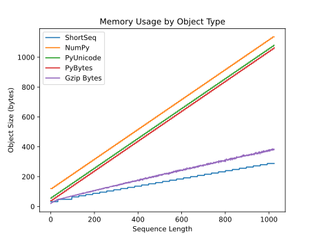
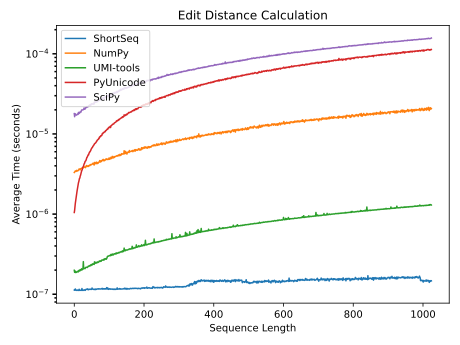
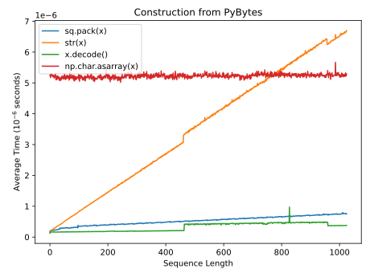

# shortseq

ShortSeqs are compact and efficient Python objects that hold short sequences while using up to 73% less memory compared to built-in types. They are prehashed and comparable, they support slicing, indexing, and a variety of vectorized operations, and they easily convert back to their original string form. Their memory advantage is shown in the table below.

| Sequence Length | PyUnicode Size | PyBytes Size | ShortSeq Size | % Reduced |
|-----------------|----------------------------|--------------------------|--------------------------:|--------------------|
| 0-32 nt         | 56-88 bytes                | 40-72 bytes              |          32 bytes (fixed) | **43-64%**         |
| 33-64 nt        | 88-120 bytes               | 72-104 bytes             |          48 bytes (fixed) | **45-60%**         |
| 65-1024 nt      | 120-1080 bytes             | 104-1064 bytes           |              56-288 bytes | **53-73%**         |

<sup>* Object sizes were measured on Python 3.10 using `asizeof()` from the `pympler` package. % Reduced is PyUnicode vs. ShortSeq</sup>


### Installation

```shell
mamba install -c bioconda -c conda-forge shortseq
```

However, I strongly recommend compiling the project from source. The instructions that make ShortSeqs fast are very specific to your CPU's microarchitecture, so the prebuilt binaries on Bioconda are not optimized for your machine. To compile from source:

```shell
git clone https://github.com/AlexTate/shortseq.git
cd shortseq
python -m pip install .
```


### Usage

```python
import shortseq as sq

# Construct from PyUnicode or PyBytes
seq_str = "ATGC"
seq_bytes = b"ATGC"
seq_1 = sq.pack(seq_str)
seq_2 = sq.pack(seq_bytes)

# Verify outputs (optional)
assert seq_1 == seq_2 == seq_str
assert len(seq_1) == len(seq_2) == len(seq_str)

seq_3 = sq.pack("TATTAGCGATTGACAGTTGTCCTGTAATAACGCCGGGTAAATTTGCCG")
seq_4 = sq.pack("TATTACCGATTGACAGTTGTCCTGTAATAACGGCGGGTAAATTTGCTG")  # 5M1X26M1X13M1X1M
seq_str = str(seq_4)

# Slice and subscript
assert seq_4[5:15] == seq_str[5:15]
assert seq_4[-2] == seq_str[-2]

# Vectorized hamming distance (differing bases)
hammd = sum(a!=b for a, b in zip(seq_3, seq_4))
assert seq_3 ^ seq_4 == hammd == 3

# Count unique sequences similar to collections.Counter
from shortseq import ShortSeqCounter
counts = ShortSeqCounter([seq_bytes] * 10)
assert counts == {sq.pack("ATGC"): 10}
```

### CPU Requirements

- Intel Haswell (2014) and newer, or
- AMD Excavator (2015) and newer, or
- Apple M1 and newer

However, AMD processors [prior to Zen 3](https://en.wikipedia.org/wiki/X86_Bit_manipulation_instruction_set#cite_ref-12) (2020) aren't recommended for 65-1024 nt sequences if runtime performance is a high priority.


## Performance

<p align="center">
  
</p>

Note that the measurement of Gzip Bytes is the _length_ in bytes of the compressed sequence at maximum compression (level 9), which is much smaller than the actual PyBytes object that `gzip.compress()` returns. This footprint is therefore unattainable when using Python's gzip module, and instead serves as a theoretical lower bound for the memory footprint of a compressed sequence.

[View source: MemoryBenchmarks.test_mem_by_length()](shortseq/tests/benchmark.py#L44)
</br></br>

<p align="center">
  
</p>

Edit distance calculation is extremely efficient for ShortSeqs and can be performed in near-constant time. This is a huge advantage over other sequence types, which require O(n) time to compute the edit distance.

[View source: TimeBenchmarks.test_hamming_distance()](shortseq/tests/benchmark.py#L121)
</br></br>

<p align="center">
  
</p>

ShortSeq construction involves encoding the sequence string into a compressed binary representation, which is an O(n) operation, whereas `x.decode()` and `np.char.asarray()` are O(1) because they essentially copy the object's internal buffer.

[View source: TimeBenchmarks.test_construction_from_bytes()](shortseq/tests/benchmark.py#L84)
</br></br>


### Encoding (Compression)

We represent DNA with four symbols: A, C, T, and G. Generally speaking, when these symbols are represented in computer systems, each symbol takes up one byte or 8 bits of memory because these letters are part of a symbol system that requires 7/8 of those bits for its range. These symbols can instead be represented ordinally as 0, 1, 2, and 3, which only requires 2 bits, allowing us to pack 4 nucleotides into each byte rather than just one.

| Nucleotide | In ASCII     |  Ordinal Value  |
|------------|--------------|:---------------:|
| A          | `0100 00 01` |      `00`       |
| C          | `0100 01 11` |      `01`       |
| T          | `0101 10 00` |      `10`       |
| G          | `0100 11 11` |      `11`       |

This table shows how each nucleotide is represented in ASCII and how it's ordinal value is represented in binary. I should mention that this scheme isn't my work, but rather a well-known technique that's been around for a while.


### Decoding

ShortSeqs are decoded back to their original sequence strings "lazily", i.e. it happens only when you ask and the result isn't cached in the object, so it has to be recomputed with each request. However, ShortSeqs retain the original string's length and can be compared to each other for equality and edit distance **without** decoding.


### Acknowledgements

Huge thanks to the Montgomery Lab at Colorado State University. This began as an experiment of mine while in pursuit of faster sequence deduplication and optimization for [tinyRNA](https://www.github.com/MontgomeryLab/tinyRNA).
